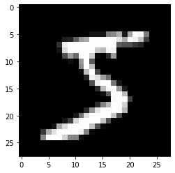

```python
from pathlib import Path
import requests
```


```python
# DATA_PATH= Path("data")
# PATH = DATA_PATH / "mnist"

# PATH.mkdir(parents=True, exist_ok=True)

# URL="https://github.com/pytorch/tutorials/raw/master/_static/"
# FILENAME="mnist.pkl.gz"

# if not (PATH / FILENAME).exists():
#         content = requests.get(URL + FILENAME).content
#         (PATH / FILENAME).open("wb").write(content)
```


```python
import pickle
import gzip

PATH="/home/admin/jupyter/mnist.pkl.gz"
with gzip.open((PATH),"rb") as f:
    ((x_train,y_train),(x_valid,y_valid),_) = pickle.load(f,encoding="latin-1")
```


```python
from matplotlib import pyplot 
import numpy as np

pyplot.imshow(x_train[0].reshape((28,28)), cmap = 'gray')
print(x_train.shape)
```

    (50000, 784)
    


    

    


```python
import torch

x_train, y_train, x_valid, y_valid = map(
    torch.tensor, (x_train, y_train, x_valid, y_valid)
)
n, c = x_train.shape

#x_train, x_train.shape, y_train.min(), y_train.max()

print(x_train, y_train)
print(x_train.shape)
print(y_train.min(), y_train.max())
```

    tensor([[0., 0., 0.,  ..., 0., 0., 0.],
            [0., 0., 0.,  ..., 0., 0., 0.],
            [0., 0., 0.,  ..., 0., 0., 0.],
            ...,
            [0., 0., 0.,  ..., 0., 0., 0.],
            [0., 0., 0.,  ..., 0., 0., 0.],
            [0., 0., 0.,  ..., 0., 0., 0.]]) tensor([5, 0, 4,  ..., 8, 4, 8])
    torch.Size([50000, 784])
    tensor(0) tensor(9)
    


```python
import math

weights = torch.randn(784, 10) / math.sqrt(784)
weights.requires_grad_()
bias = torch.zeros(10, requires_grad=True)
```


```python
print(weights)
print(bias)
```

    tensor([[ 0.0835,  0.0340,  0.0441,  ...,  0.0169,  0.0099,  0.0106],
            [-0.0062,  0.0043, -0.0097,  ..., -0.0013,  0.0179,  0.0286],
            [ 0.0281, -0.0279, -0.0499,  ...,  0.0174, -0.0558,  0.0699],
            ...,
            [-0.0359, -0.0118, -0.0127,  ..., -0.0029, -0.0187, -0.0648],
            [-0.0368, -0.0651,  0.0421,  ...,  0.0289, -0.0165,  0.0392],
            [-0.0459, -0.0654,  0.0235,  ...,  0.0283,  0.0763, -0.0112]],
           requires_grad=True)
    tensor([0., 0., 0., 0., 0., 0., 0., 0., 0., 0.], requires_grad=True)
    


```python
def log_softmax(x):
    return x - x.exp().sum(-1).log().unsqueeze(-1)

def model(xb):
    return log_softmax(xb @ weights + bias)
```


```python
bs = 64  # batch size

xb = x_train[0:bs]  # a mini-batch from x
preds = model(xb)  # predictions

print(preds[0], preds.shape)
```

    tensor([-2.2345, -2.4004, -2.0948, -2.4728, -2.1531, -2.0935, -2.4086, -2.4636,
            -3.1251, -1.9918], grad_fn=<SelectBackward>) torch.Size([64, 10])
    


```python
def nll(input, target):
#     print(range(target.shape[0]))
#     print(target)
#     print(input)
#     print(input[range(target.shape[0]),target])
    return -input[range(target.shape[0]), target].mean()

loss_func = nll
```


```python
yb = y_train[0:bs]
print(loss_func(preds, yb))
```

    tensor(2.4620, grad_fn=<NegBackward>)
    


```python
def accuracy(out, yb):
    preds = torch.argmax(out, dim=1)
    return (preds == yb).float().mean()
```


```python
print(accuracy(preds, yb))
```

    tensor(0.0469)
    


```python
from IPython.core.debugger import set_trace

lr = 0.5  # learning rate
epochs = 1  # how many epochs to train for

for epoch in range(epochs):
    for i in range((n - 1) // bs + 1):
        #         set_trace()
        start_i = i * bs
        end_i = start_i + bs
        xb = x_train[start_i:end_i]
        yb = y_train[start_i:end_i]
        pred = model(xb)
        loss = loss_func(pred, yb)
        print(loss_func(model(xb), yb), accuracy(model(xb), yb),i)
        loss.backward()
        with torch.no_grad():
            weights -= weights.grad * lr
            bias -= bias.grad * lr
            weights.grad.zero_()
            bias.grad.zero_()
```

    tensor(0.2290, grad_fn=<NegBackward>) tensor(0.9531) 0
    tensor(0.1966, grad_fn=<NegBackward>) tensor(0.9844) 1
    tensor(0.4231, grad_fn=<NegBackward>) tensor(0.9062) 2
    tensor(0.3124, grad_fn=<NegBackward>) tensor(0.9062) 3
    tensor(0.3737, grad_fn=<NegBackward>) tensor(0.8906) 4
    tensor(0.0984, grad_fn=<NegBackward>) tensor(0.9688) 5
    tensor(0.1879, grad_fn=<NegBackward>) tensor(0.9219) 6
    tensor(0.4523, grad_fn=<NegBackward>) tensor(0.9062) 7
    tensor(0.1968, grad_fn=<NegBackward>) tensor(0.9219) 8
    tensor(0.3837, grad_fn=<NegBackward>) tensor(0.9219) 9
    tensor(0.3298, grad_fn=<NegBackward>) tensor(0.9531) 10
    tensor(0.1970, grad_fn=<NegBackward>) tensor(0.9375) 11
    tensor(0.2964, grad_fn=<NegBackward>) tensor(0.9062) 12
    tensor(0.5279, grad_fn=<NegBackward>) tensor(0.8594) 13
    tensor(0.4005, grad_fn=<NegBackward>) tensor(0.8906) 14
    tensor(0.2711, grad_fn=<NegBackward>) tensor(0.8906) 15
    tensor(0.6134, grad_fn=<NegBackward>) tensor(0.8594) 16
    tensor(0.6355, grad_fn=<NegBackward>) tensor(0.7969) 17
    tensor(0.0787, grad_fn=<NegBackward>) tensor(0.9844) 18
    tensor(0.5592, grad_fn=<NegBackward>) tensor(0.8906) 19
    tensor(0.3538, grad_fn=<NegBackward>) tensor(0.8906) 20
    tensor(0.6690, grad_fn=<NegBackward>) tensor(0.8438) 21
    tensor(0.2229, grad_fn=<NegBackward>) tensor(0.9062) 22
    tensor(0.2928, grad_fn=<NegBackward>) tensor(0.8906) 23
    tensor(0.3238, grad_fn=<NegBackward>) tensor(0.9219) 24
    tensor(0.1600, grad_fn=<NegBackward>) tensor(0.9688) 25
    tensor(0.1984, grad_fn=<NegBackward>) tensor(0.9531) 26
    tensor(0.1788, grad_fn=<NegBackward>) tensor(0.9531) 27
    tensor(0.2495, grad_fn=<NegBackward>) tensor(0.9375) 28
    tensor(0.0954, grad_fn=<NegBackward>) tensor(0.9844) 29
    tensor(0.2004, grad_fn=<NegBackward>) tensor(0.9375) 30
    tensor(0.2476, grad_fn=<NegBackward>) tensor(0.9219) 31
    tensor(0.3095, grad_fn=<NegBackward>) tensor(0.9375) 32
    tensor(0.1611, grad_fn=<NegBackward>) tensor(0.9531) 33
    tensor(0.3035, grad_fn=<NegBackward>) tensor(0.8906) 34
    tensor(0.1341, grad_fn=<NegBackward>) tensor(0.9375) 35
    tensor(0.1506, grad_fn=<NegBackward>) tensor(0.9531) 36
    tensor(0.3068, grad_fn=<NegBackward>) tensor(0.9219) 37
    tensor(0.1201, grad_fn=<NegBackward>) tensor(0.9688) 38
    tensor(0.1016, grad_fn=<NegBackward>) tensor(0.9844) 39
    tensor(0.1887, grad_fn=<NegBackward>) tensor(0.9375) 40
    tensor(0.4309, grad_fn=<NegBackward>) tensor(0.9219) 41
    tensor(0.2468, grad_fn=<NegBackward>) tensor(0.9375) 42
    tensor(0.3273, grad_fn=<NegBackward>) tensor(0.8750) 43
    tensor(0.2163, grad_fn=<NegBackward>) tensor(0.9375) 44
    tensor(0.1946, grad_fn=<NegBackward>) tensor(0.9375) 45
    tensor(0.2402, grad_fn=<NegBackward>) tensor(0.9375) 46
    tensor(0.3866, grad_fn=<NegBackward>) tensor(0.8750) 47
    tensor(0.2276, grad_fn=<NegBackward>) tensor(0.9219) 48
    tensor(0.1365, grad_fn=<NegBackward>) tensor(0.9688) 49
    tensor(0.3250, grad_fn=<NegBackward>) tensor(0.8906) 50
    tensor(0.2802, grad_fn=<NegBackward>) tensor(0.9219) 51
    tensor(0.2004, grad_fn=<NegBackward>) tensor(0.9219) 52
    tensor(0.1899, grad_fn=<NegBackward>) tensor(0.9375) 53
    tensor(0.2503, grad_fn=<NegBackward>) tensor(0.9688) 54
    tensor(0.2356, grad_fn=<NegBackward>) tensor(0.9375) 55
    tensor(0.1015, grad_fn=<NegBackward>) tensor(0.9688) 56
    tensor(0.4917, grad_fn=<NegBackward>) tensor(0.8750) 57
    tensor(0.3833, grad_fn=<NegBackward>) tensor(0.9062) 58
    tensor(0.3293, grad_fn=<NegBackward>) tensor(0.9062) 59
    tensor(0.1096, grad_fn=<NegBackward>) tensor(0.9844) 60
    tensor(0.0975, grad_fn=<NegBackward>) tensor(1.) 61
    tensor(0.2863, grad_fn=<NegBackward>) tensor(0.9062) 62
    tensor(0.3870, grad_fn=<NegBackward>) tensor(0.9219) 63
    tensor(0.3800, grad_fn=<NegBackward>) tensor(0.9062) 64
    tensor(0.3360, grad_fn=<NegBackward>) tensor(0.9062) 65
    tensor(0.2994, grad_fn=<NegBackward>) tensor(0.9062) 66
    tensor(0.1899, grad_fn=<NegBackward>) tensor(0.9375) 67
    tensor(0.2297, grad_fn=<NegBackward>) tensor(0.9531) 68
    tensor(0.2060, grad_fn=<NegBackward>) tensor(0.9219) 69
    tensor(0.2446, grad_fn=<NegBackward>) tensor(0.9688) 70
    tensor(0.1042, grad_fn=<NegBackward>) tensor(0.9688) 71
    tensor(0.3463, grad_fn=<NegBackward>) tensor(0.8906) 72
    tensor(0.1810, grad_fn=<NegBackward>) tensor(0.9375) 73
    tensor(0.2771, grad_fn=<NegBackward>) tensor(0.9062) 74
    tensor(0.2807, grad_fn=<NegBackward>) tensor(0.9062) 75
    tensor(0.1729, grad_fn=<NegBackward>) tensor(0.9062) 76
    tensor(0.4811, grad_fn=<NegBackward>) tensor(0.9062) 77
    tensor(0.2771, grad_fn=<NegBackward>) tensor(0.9375) 78
    tensor(0.2300, grad_fn=<NegBackward>) tensor(0.9219) 79
    tensor(0.5839, grad_fn=<NegBackward>) tensor(0.8438) 80
    tensor(0.2051, grad_fn=<NegBackward>) tensor(0.9531) 81
    tensor(0.3245, grad_fn=<NegBackward>) tensor(0.9219) 82
    tensor(0.2555, grad_fn=<NegBackward>) tensor(0.9531) 83
    tensor(0.2292, grad_fn=<NegBackward>) tensor(0.9219) 84
    tensor(0.0827, grad_fn=<NegBackward>) tensor(0.9844) 85
    tensor(0.3567, grad_fn=<NegBackward>) tensor(0.9062) 86
    tensor(0.2173, grad_fn=<NegBackward>) tensor(0.8906) 87
    tensor(0.3253, grad_fn=<NegBackward>) tensor(0.9062) 88
    tensor(0.2721, grad_fn=<NegBackward>) tensor(0.9219) 89
    tensor(0.2162, grad_fn=<NegBackward>) tensor(0.9219) 90
    tensor(0.3483, grad_fn=<NegBackward>) tensor(0.9531) 91
    tensor(0.2756, grad_fn=<NegBackward>) tensor(0.9375) 92
    tensor(0.2242, grad_fn=<NegBackward>) tensor(0.9844) 93
    tensor(0.1560, grad_fn=<NegBackward>) tensor(0.9531) 94
    tensor(0.3293, grad_fn=<NegBackward>) tensor(0.9219) 95
    tensor(0.1111, grad_fn=<NegBackward>) tensor(0.9844) 96
    tensor(0.1860, grad_fn=<NegBackward>) tensor(0.9531) 97
    tensor(0.1102, grad_fn=<NegBackward>) tensor(0.9688) 98
    tensor(0.1339, grad_fn=<NegBackward>) tensor(0.9688) 99
    tensor(0.2581, grad_fn=<NegBackward>) tensor(0.9219) 100
    tensor(0.3485, grad_fn=<NegBackward>) tensor(0.9062) 101
    tensor(0.1512, grad_fn=<NegBackward>) tensor(0.9375) 102
    tensor(0.1913, grad_fn=<NegBackward>) tensor(0.9531) 103
    tensor(0.1896, grad_fn=<NegBackward>) tensor(0.9531) 104
    tensor(0.1519, grad_fn=<NegBackward>) tensor(0.9531) 105
    tensor(0.3759, grad_fn=<NegBackward>) tensor(0.8750) 106
    tensor(0.4371, grad_fn=<NegBackward>) tensor(0.9062) 107
    tensor(0.4462, grad_fn=<NegBackward>) tensor(0.8438) 108
    tensor(0.5664, grad_fn=<NegBackward>) tensor(0.8281) 109
    tensor(0.2091, grad_fn=<NegBackward>) tensor(0.9531) 110
    tensor(0.3308, grad_fn=<NegBackward>) tensor(0.9062) 111
    tensor(0.3488, grad_fn=<NegBackward>) tensor(0.8594) 112
    tensor(0.3993, grad_fn=<NegBackward>) tensor(0.8750) 113
    tensor(0.4175, grad_fn=<NegBackward>) tensor(0.8906) 114
    tensor(0.1784, grad_fn=<NegBackward>) tensor(0.9219) 115
    tensor(0.1863, grad_fn=<NegBackward>) tensor(0.9375) 116
    tensor(0.2938, grad_fn=<NegBackward>) tensor(0.9219) 117
    tensor(0.2148, grad_fn=<NegBackward>) tensor(0.9219) 118
    tensor(0.2801, grad_fn=<NegBackward>) tensor(0.9062) 119
    tensor(0.2299, grad_fn=<NegBackward>) tensor(0.9219) 120
    tensor(0.2469, grad_fn=<NegBackward>) tensor(0.9219) 121
    tensor(0.4791, grad_fn=<NegBackward>) tensor(0.8906) 122
    tensor(0.3871, grad_fn=<NegBackward>) tensor(0.8906) 123
    tensor(0.2210, grad_fn=<NegBackward>) tensor(0.8906) 124
    tensor(0.1902, grad_fn=<NegBackward>) tensor(0.9219) 125
    tensor(0.3780, grad_fn=<NegBackward>) tensor(0.8750) 126
    tensor(0.1539, grad_fn=<NegBackward>) tensor(0.9375) 127
    tensor(0.5724, grad_fn=<NegBackward>) tensor(0.8906) 128
    tensor(0.2973, grad_fn=<NegBackward>) tensor(0.8906) 129
    tensor(0.1604, grad_fn=<NegBackward>) tensor(0.9531) 130
    tensor(0.2790, grad_fn=<NegBackward>) tensor(0.8906) 131
    tensor(0.5349, grad_fn=<NegBackward>) tensor(0.8594) 132
    tensor(0.2383, grad_fn=<NegBackward>) tensor(0.9375) 133
    tensor(0.2465, grad_fn=<NegBackward>) tensor(0.9062) 134
    tensor(0.5083, grad_fn=<NegBackward>) tensor(0.9062) 135
    tensor(0.7555, grad_fn=<NegBackward>) tensor(0.8281) 136
    tensor(0.5010, grad_fn=<NegBackward>) tensor(0.8281) 137
    tensor(0.5370, grad_fn=<NegBackward>) tensor(0.8438) 138
    tensor(0.3723, grad_fn=<NegBackward>) tensor(0.9062) 139
    tensor(0.2249, grad_fn=<NegBackward>) tensor(0.9375) 140
    tensor(0.1361, grad_fn=<NegBackward>) tensor(0.9688) 141
    tensor(0.3973, grad_fn=<NegBackward>) tensor(0.9062) 142
    tensor(0.2326, grad_fn=<NegBackward>) tensor(0.9375) 143
    tensor(0.3509, grad_fn=<NegBackward>) tensor(0.9219) 144
    tensor(0.2992, grad_fn=<NegBackward>) tensor(0.9375) 145
    tensor(0.3303, grad_fn=<NegBackward>) tensor(0.8594) 146
    tensor(0.4748, grad_fn=<NegBackward>) tensor(0.8750) 147
    tensor(0.2558, grad_fn=<NegBackward>) tensor(0.9375) 148
    tensor(0.3794, grad_fn=<NegBackward>) tensor(0.9219) 149
    tensor(0.2040, grad_fn=<NegBackward>) tensor(0.9062) 150
    tensor(0.0711, grad_fn=<NegBackward>) tensor(0.9844) 151
    tensor(0.4135, grad_fn=<NegBackward>) tensor(0.9219) 152
    tensor(0.0817, grad_fn=<NegBackward>) tensor(0.9531) 153
    tensor(0.1435, grad_fn=<NegBackward>) tensor(0.9531) 154
    tensor(0.2393, grad_fn=<NegBackward>) tensor(0.9219) 155
    tensor(0.3353, grad_fn=<NegBackward>) tensor(0.9375) 156
    tensor(0.1768, grad_fn=<NegBackward>) tensor(0.9688) 157
    tensor(0.2211, grad_fn=<NegBackward>) tensor(0.9375) 158
    tensor(0.4962, grad_fn=<NegBackward>) tensor(0.8594) 159
    tensor(0.1927, grad_fn=<NegBackward>) tensor(0.9688) 160
    tensor(0.2198, grad_fn=<NegBackward>) tensor(0.9375) 161
    tensor(0.1300, grad_fn=<NegBackward>) tensor(0.9531) 162
    tensor(0.1959, grad_fn=<NegBackward>) tensor(0.9375) 163
    tensor(0.0767, grad_fn=<NegBackward>) tensor(0.9844) 164
    tensor(0.1195, grad_fn=<NegBackward>) tensor(0.9688) 165
    tensor(0.2003, grad_fn=<NegBackward>) tensor(0.9688) 166
    tensor(0.4011, grad_fn=<NegBackward>) tensor(0.9062) 167
    tensor(0.2680, grad_fn=<NegBackward>) tensor(0.9219) 168
    tensor(0.2334, grad_fn=<NegBackward>) tensor(0.9688) 169
    tensor(0.1878, grad_fn=<NegBackward>) tensor(0.9531) 170
    tensor(0.2487, grad_fn=<NegBackward>) tensor(0.9531) 171
    tensor(0.2277, grad_fn=<NegBackward>) tensor(0.9375) 172
    tensor(0.1443, grad_fn=<NegBackward>) tensor(0.9688) 173
    tensor(0.1246, grad_fn=<NegBackward>) tensor(0.9688) 174
    tensor(0.2787, grad_fn=<NegBackward>) tensor(0.9062) 175
    tensor(0.1445, grad_fn=<NegBackward>) tensor(0.9219) 176
    tensor(0.1817, grad_fn=<NegBackward>) tensor(0.9062) 177
    tensor(0.2303, grad_fn=<NegBackward>) tensor(0.9219) 178
    tensor(0.2686, grad_fn=<NegBackward>) tensor(0.9219) 179
    tensor(0.5171, grad_fn=<NegBackward>) tensor(0.8438) 180
    tensor(0.4021, grad_fn=<NegBackward>) tensor(0.8750) 181
    tensor(0.5472, grad_fn=<NegBackward>) tensor(0.8438) 182
    tensor(0.4557, grad_fn=<NegBackward>) tensor(0.9375) 183
    tensor(0.1656, grad_fn=<NegBackward>) tensor(0.9375) 184
    tensor(0.3178, grad_fn=<NegBackward>) tensor(0.8906) 185
    tensor(0.2047, grad_fn=<NegBackward>) tensor(0.9531) 186
    tensor(0.2103, grad_fn=<NegBackward>) tensor(0.9219) 187
    tensor(0.3143, grad_fn=<NegBackward>) tensor(0.9062) 188
    tensor(0.1960, grad_fn=<NegBackward>) tensor(0.9375) 189
    tensor(0.4551, grad_fn=<NegBackward>) tensor(0.9062) 190
    tensor(0.2284, grad_fn=<NegBackward>) tensor(0.9062) 191
    tensor(0.2874, grad_fn=<NegBackward>) tensor(0.9219) 192
    tensor(0.3200, grad_fn=<NegBackward>) tensor(0.9219) 193
    tensor(0.2847, grad_fn=<NegBackward>) tensor(0.8906) 194
    tensor(0.3863, grad_fn=<NegBackward>) tensor(0.9375) 195
    tensor(0.6186, grad_fn=<NegBackward>) tensor(0.8594) 196
    tensor(0.6528, grad_fn=<NegBackward>) tensor(0.8594) 197
    tensor(0.4870, grad_fn=<NegBackward>) tensor(0.9062) 198
    tensor(0.3220, grad_fn=<NegBackward>) tensor(0.8750) 199
    tensor(0.1813, grad_fn=<NegBackward>) tensor(0.9219) 200
    tensor(0.2454, grad_fn=<NegBackward>) tensor(0.9375) 201
    tensor(0.5104, grad_fn=<NegBackward>) tensor(0.8594) 202
    tensor(0.5671, grad_fn=<NegBackward>) tensor(0.8750) 203
    tensor(0.4465, grad_fn=<NegBackward>) tensor(0.8438) 204
    tensor(0.3678, grad_fn=<NegBackward>) tensor(0.8750) 205
    tensor(0.2346, grad_fn=<NegBackward>) tensor(0.9531) 206
    tensor(0.2671, grad_fn=<NegBackward>) tensor(0.9531) 207
    tensor(0.2266, grad_fn=<NegBackward>) tensor(0.9062) 208
    tensor(0.3039, grad_fn=<NegBackward>) tensor(0.9219) 209
    tensor(0.1889, grad_fn=<NegBackward>) tensor(0.9844) 210
    tensor(0.3704, grad_fn=<NegBackward>) tensor(0.8906) 211
    tensor(0.1137, grad_fn=<NegBackward>) tensor(0.9844) 212
    tensor(0.4344, grad_fn=<NegBackward>) tensor(0.8750) 213
    tensor(0.4054, grad_fn=<NegBackward>) tensor(0.9062) 214
    tensor(0.1926, grad_fn=<NegBackward>) tensor(0.9375) 215
    tensor(0.3656, grad_fn=<NegBackward>) tensor(0.9062) 216
    tensor(0.2672, grad_fn=<NegBackward>) tensor(0.9062) 217
    tensor(0.6100, grad_fn=<NegBackward>) tensor(0.8281) 218
    tensor(0.4732, grad_fn=<NegBackward>) tensor(0.8750) 219
    tensor(0.3543, grad_fn=<NegBackward>) tensor(0.9062) 220
    tensor(0.3166, grad_fn=<NegBackward>) tensor(0.8750) 221
    tensor(0.3074, grad_fn=<NegBackward>) tensor(0.8750) 222
    tensor(0.3635, grad_fn=<NegBackward>) tensor(0.8906) 223
    tensor(0.7727, grad_fn=<NegBackward>) tensor(0.8281) 224
    tensor(0.3015, grad_fn=<NegBackward>) tensor(0.9062) 225
    tensor(0.2394, grad_fn=<NegBackward>) tensor(0.9219) 226
    tensor(0.3801, grad_fn=<NegBackward>) tensor(0.8906) 227
    tensor(0.4118, grad_fn=<NegBackward>) tensor(0.8438) 228
    tensor(0.4173, grad_fn=<NegBackward>) tensor(0.8750) 229
    tensor(0.5973, grad_fn=<NegBackward>) tensor(0.8125) 230
    tensor(0.6625, grad_fn=<NegBackward>) tensor(0.8125) 231
    tensor(0.2372, grad_fn=<NegBackward>) tensor(0.9219) 232
    tensor(0.2202, grad_fn=<NegBackward>) tensor(0.9531) 233
    tensor(0.2182, grad_fn=<NegBackward>) tensor(0.9531) 234
    tensor(0.2192, grad_fn=<NegBackward>) tensor(0.9219) 235
    tensor(0.5351, grad_fn=<NegBackward>) tensor(0.8750) 236
    tensor(0.2974, grad_fn=<NegBackward>) tensor(0.9219) 237
    tensor(0.2321, grad_fn=<NegBackward>) tensor(0.9219) 238
    tensor(0.2171, grad_fn=<NegBackward>) tensor(0.9531) 239
    tensor(0.1582, grad_fn=<NegBackward>) tensor(0.9375) 240
    tensor(0.2351, grad_fn=<NegBackward>) tensor(0.9375) 241
    tensor(0.2856, grad_fn=<NegBackward>) tensor(0.9375) 242
    tensor(0.2351, grad_fn=<NegBackward>) tensor(0.9062) 243
    tensor(0.1833, grad_fn=<NegBackward>) tensor(0.9531) 244
    tensor(0.3335, grad_fn=<NegBackward>) tensor(0.9062) 245
    tensor(0.3484, grad_fn=<NegBackward>) tensor(0.8594) 246
    tensor(0.2685, grad_fn=<NegBackward>) tensor(0.8594) 247
    tensor(0.1965, grad_fn=<NegBackward>) tensor(0.9375) 248
    tensor(0.6121, grad_fn=<NegBackward>) tensor(0.8906) 249
    tensor(0.4728, grad_fn=<NegBackward>) tensor(0.8438) 250
    tensor(0.1813, grad_fn=<NegBackward>) tensor(0.9688) 251
    tensor(0.1498, grad_fn=<NegBackward>) tensor(0.9219) 252
    tensor(0.2012, grad_fn=<NegBackward>) tensor(0.9219) 253
    tensor(0.2376, grad_fn=<NegBackward>) tensor(0.9531) 254
    tensor(0.2776, grad_fn=<NegBackward>) tensor(0.9531) 255
    tensor(0.1710, grad_fn=<NegBackward>) tensor(0.9531) 256
    tensor(0.2826, grad_fn=<NegBackward>) tensor(0.9375) 257
    tensor(0.4555, grad_fn=<NegBackward>) tensor(0.9219) 258
    tensor(0.2976, grad_fn=<NegBackward>) tensor(0.9219) 259
    tensor(0.3417, grad_fn=<NegBackward>) tensor(0.8594) 260
    tensor(0.2354, grad_fn=<NegBackward>) tensor(0.9219) 261
    tensor(0.3387, grad_fn=<NegBackward>) tensor(0.8906) 262
    tensor(0.2334, grad_fn=<NegBackward>) tensor(0.9531) 263
    tensor(0.2595, grad_fn=<NegBackward>) tensor(0.9219) 264
    tensor(0.3347, grad_fn=<NegBackward>) tensor(0.8750) 265
    tensor(0.3314, grad_fn=<NegBackward>) tensor(0.9219) 266
    tensor(0.2751, grad_fn=<NegBackward>) tensor(0.9062) 267
    tensor(0.3100, grad_fn=<NegBackward>) tensor(0.9062) 268
    tensor(0.3962, grad_fn=<NegBackward>) tensor(0.8906) 269
    tensor(0.1356, grad_fn=<NegBackward>) tensor(0.9688) 270
    tensor(0.2901, grad_fn=<NegBackward>) tensor(0.9219) 271
    tensor(0.2324, grad_fn=<NegBackward>) tensor(0.9531) 272
    tensor(0.3740, grad_fn=<NegBackward>) tensor(0.8906) 273
    tensor(0.4738, grad_fn=<NegBackward>) tensor(0.8750) 274
    tensor(0.2218, grad_fn=<NegBackward>) tensor(0.9531) 275
    tensor(0.3404, grad_fn=<NegBackward>) tensor(0.9062) 276
    tensor(0.2918, grad_fn=<NegBackward>) tensor(0.9062) 277
    tensor(0.4266, grad_fn=<NegBackward>) tensor(0.8750) 278
    tensor(0.2366, grad_fn=<NegBackward>) tensor(0.8906) 279
    tensor(0.2242, grad_fn=<NegBackward>) tensor(0.9531) 280
    tensor(0.2466, grad_fn=<NegBackward>) tensor(0.9219) 281
    tensor(0.2818, grad_fn=<NegBackward>) tensor(0.9375) 282
    tensor(0.1438, grad_fn=<NegBackward>) tensor(0.9688) 283
    tensor(0.1248, grad_fn=<NegBackward>) tensor(0.9688) 284
    tensor(0.2005, grad_fn=<NegBackward>) tensor(0.9688) 285
    tensor(0.2522, grad_fn=<NegBackward>) tensor(0.9688) 286
    tensor(0.2513, grad_fn=<NegBackward>) tensor(0.9062) 287
    tensor(0.3082, grad_fn=<NegBackward>) tensor(0.9219) 288
    tensor(0.2442, grad_fn=<NegBackward>) tensor(0.9375) 289
    tensor(0.4060, grad_fn=<NegBackward>) tensor(0.9219) 290
    tensor(0.1749, grad_fn=<NegBackward>) tensor(0.9688) 291
    tensor(0.3489, grad_fn=<NegBackward>) tensor(0.9375) 292
    tensor(0.1176, grad_fn=<NegBackward>) tensor(0.9688) 293
    tensor(0.3118, grad_fn=<NegBackward>) tensor(0.9219) 294
    tensor(0.1484, grad_fn=<NegBackward>) tensor(0.9531) 295
    tensor(0.1716, grad_fn=<NegBackward>) tensor(0.9375) 296
    tensor(0.3110, grad_fn=<NegBackward>) tensor(0.8906) 297
    tensor(0.2911, grad_fn=<NegBackward>) tensor(0.9375) 298
    tensor(0.2060, grad_fn=<NegBackward>) tensor(0.9375) 299
    tensor(0.3290, grad_fn=<NegBackward>) tensor(0.9219) 300
    tensor(0.1798, grad_fn=<NegBackward>) tensor(0.9531) 301
    tensor(0.2669, grad_fn=<NegBackward>) tensor(0.9219) 302
    tensor(0.2860, grad_fn=<NegBackward>) tensor(0.8750) 303
    tensor(0.3180, grad_fn=<NegBackward>) tensor(0.9219) 304
    tensor(0.3236, grad_fn=<NegBackward>) tensor(0.9062) 305
    tensor(0.2250, grad_fn=<NegBackward>) tensor(0.9531) 306
    tensor(0.1440, grad_fn=<NegBackward>) tensor(0.9688) 307
    tensor(0.0926, grad_fn=<NegBackward>) tensor(0.9531) 308
    tensor(0.4173, grad_fn=<NegBackward>) tensor(0.9219) 309
    tensor(0.1454, grad_fn=<NegBackward>) tensor(0.9375) 310
    tensor(0.2552, grad_fn=<NegBackward>) tensor(0.9219) 311
    tensor(0.3072, grad_fn=<NegBackward>) tensor(0.8906) 312
    tensor(0.3194, grad_fn=<NegBackward>) tensor(0.8906) 313
    tensor(0.1750, grad_fn=<NegBackward>) tensor(0.9688) 314
    tensor(0.5099, grad_fn=<NegBackward>) tensor(0.8594) 315
    tensor(0.1880, grad_fn=<NegBackward>) tensor(0.9375) 316
    tensor(0.2580, grad_fn=<NegBackward>) tensor(0.9375) 317
    tensor(0.1474, grad_fn=<NegBackward>) tensor(0.9531) 318
    tensor(0.1742, grad_fn=<NegBackward>) tensor(0.9219) 319
    tensor(0.1688, grad_fn=<NegBackward>) tensor(0.9531) 320
    tensor(0.3786, grad_fn=<NegBackward>) tensor(0.9219) 321
    tensor(0.2710, grad_fn=<NegBackward>) tensor(0.9219) 322
    tensor(0.5224, grad_fn=<NegBackward>) tensor(0.9219) 323
    tensor(0.3538, grad_fn=<NegBackward>) tensor(0.9062) 324
    tensor(0.3891, grad_fn=<NegBackward>) tensor(0.9375) 325
    tensor(0.6260, grad_fn=<NegBackward>) tensor(0.8750) 326
    tensor(0.6873, grad_fn=<NegBackward>) tensor(0.8438) 327
    tensor(0.3933, grad_fn=<NegBackward>) tensor(0.9062) 328
    tensor(0.3587, grad_fn=<NegBackward>) tensor(0.9375) 329
    tensor(0.2769, grad_fn=<NegBackward>) tensor(0.9688) 330
    tensor(0.2709, grad_fn=<NegBackward>) tensor(0.9219) 331
    tensor(0.1470, grad_fn=<NegBackward>) tensor(0.9688) 332
    tensor(0.2822, grad_fn=<NegBackward>) tensor(0.9375) 333
    tensor(0.2833, grad_fn=<NegBackward>) tensor(0.9375) 334
    tensor(0.0838, grad_fn=<NegBackward>) tensor(0.9844) 335
    tensor(0.1997, grad_fn=<NegBackward>) tensor(0.9375) 336
    tensor(0.5073, grad_fn=<NegBackward>) tensor(0.8906) 337
    tensor(0.2615, grad_fn=<NegBackward>) tensor(0.9219) 338
    tensor(0.2364, grad_fn=<NegBackward>) tensor(0.9375) 339
    tensor(0.0790, grad_fn=<NegBackward>) tensor(1.) 340
    tensor(0.0912, grad_fn=<NegBackward>) tensor(0.9844) 341
    tensor(0.2534, grad_fn=<NegBackward>) tensor(0.8750) 342
    tensor(0.3411, grad_fn=<NegBackward>) tensor(0.9375) 343
    tensor(0.0924, grad_fn=<NegBackward>) tensor(0.9844) 344
    tensor(0.3270, grad_fn=<NegBackward>) tensor(0.9062) 345
    tensor(0.3934, grad_fn=<NegBackward>) tensor(0.8906) 346
    tensor(0.4873, grad_fn=<NegBackward>) tensor(0.9375) 347
    tensor(0.2790, grad_fn=<NegBackward>) tensor(0.9219) 348
    tensor(0.0671, grad_fn=<NegBackward>) tensor(1.) 349
    tensor(0.2396, grad_fn=<NegBackward>) tensor(0.9219) 350
    tensor(0.4930, grad_fn=<NegBackward>) tensor(0.8281) 351
    tensor(0.6228, grad_fn=<NegBackward>) tensor(0.8125) 352
    tensor(0.4268, grad_fn=<NegBackward>) tensor(0.8750) 353
    tensor(0.2261, grad_fn=<NegBackward>) tensor(0.9375) 354
    tensor(0.2204, grad_fn=<NegBackward>) tensor(0.8906) 355
    tensor(0.2365, grad_fn=<NegBackward>) tensor(0.9062) 356
    tensor(0.2115, grad_fn=<NegBackward>) tensor(0.9219) 357
    tensor(0.0798, grad_fn=<NegBackward>) tensor(0.9688) 358
    tensor(0.2661, grad_fn=<NegBackward>) tensor(0.9219) 359
    tensor(0.4286, grad_fn=<NegBackward>) tensor(0.8750) 360
    tensor(0.3185, grad_fn=<NegBackward>) tensor(0.9531) 361
    tensor(0.3047, grad_fn=<NegBackward>) tensor(0.8906) 362
    tensor(0.1103, grad_fn=<NegBackward>) tensor(0.9531) 363
    tensor(0.1722, grad_fn=<NegBackward>) tensor(0.9375) 364
    tensor(0.2161, grad_fn=<NegBackward>) tensor(0.9375) 365
    tensor(0.3394, grad_fn=<NegBackward>) tensor(0.8750) 366
    tensor(0.2046, grad_fn=<NegBackward>) tensor(0.9375) 367
    tensor(0.2537, grad_fn=<NegBackward>) tensor(0.9219) 368
    tensor(0.2185, grad_fn=<NegBackward>) tensor(0.9219) 369
    tensor(0.5127, grad_fn=<NegBackward>) tensor(0.8438) 370
    tensor(0.1585, grad_fn=<NegBackward>) tensor(0.9531) 371
    tensor(0.3461, grad_fn=<NegBackward>) tensor(0.9219) 372
    tensor(0.2776, grad_fn=<NegBackward>) tensor(0.9219) 373
    tensor(0.4539, grad_fn=<NegBackward>) tensor(0.9219) 374
    tensor(0.3157, grad_fn=<NegBackward>) tensor(0.9219) 375
    tensor(0.1918, grad_fn=<NegBackward>) tensor(0.9375) 376
    tensor(0.1760, grad_fn=<NegBackward>) tensor(0.9375) 377
    tensor(0.2726, grad_fn=<NegBackward>) tensor(0.9375) 378
    tensor(0.4002, grad_fn=<NegBackward>) tensor(0.8438) 379
    tensor(0.1822, grad_fn=<NegBackward>) tensor(0.9531) 380
    tensor(0.2101, grad_fn=<NegBackward>) tensor(0.9219) 381
    tensor(0.2852, grad_fn=<NegBackward>) tensor(0.9531) 382
    tensor(0.4057, grad_fn=<NegBackward>) tensor(0.8750) 383
    tensor(0.3294, grad_fn=<NegBackward>) tensor(0.9062) 384
    tensor(0.3778, grad_fn=<NegBackward>) tensor(0.8594) 385
    tensor(0.2728, grad_fn=<NegBackward>) tensor(0.8906) 386
    tensor(0.4420, grad_fn=<NegBackward>) tensor(0.9688) 387
    tensor(0.2529, grad_fn=<NegBackward>) tensor(0.8906) 388
    tensor(0.3377, grad_fn=<NegBackward>) tensor(0.8594) 389
    tensor(0.2739, grad_fn=<NegBackward>) tensor(0.9531) 390
    tensor(0.0958, grad_fn=<NegBackward>) tensor(0.9688) 391
    tensor(0.3008, grad_fn=<NegBackward>) tensor(0.9219) 392
    tensor(0.2767, grad_fn=<NegBackward>) tensor(0.9219) 393
    tensor(0.2086, grad_fn=<NegBackward>) tensor(0.9219) 394
    tensor(0.4601, grad_fn=<NegBackward>) tensor(0.8750) 395
    tensor(0.0903, grad_fn=<NegBackward>) tensor(0.9688) 396
    tensor(0.0884, grad_fn=<NegBackward>) tensor(0.9688) 397
    tensor(0.2445, grad_fn=<NegBackward>) tensor(0.9375) 398
    tensor(0.3204, grad_fn=<NegBackward>) tensor(0.9219) 399
    tensor(0.2042, grad_fn=<NegBackward>) tensor(0.9219) 400
    tensor(0.2333, grad_fn=<NegBackward>) tensor(0.9219) 401
    tensor(0.2185, grad_fn=<NegBackward>) tensor(0.9375) 402
    tensor(0.4152, grad_fn=<NegBackward>) tensor(0.8594) 403
    tensor(0.1554, grad_fn=<NegBackward>) tensor(0.9375) 404
    tensor(0.2142, grad_fn=<NegBackward>) tensor(0.9219) 405
    tensor(0.1894, grad_fn=<NegBackward>) tensor(0.9688) 406
    tensor(0.2326, grad_fn=<NegBackward>) tensor(0.9219) 407
    tensor(0.1610, grad_fn=<NegBackward>) tensor(0.9531) 408
    tensor(0.1598, grad_fn=<NegBackward>) tensor(0.9531) 409
    tensor(0.2960, grad_fn=<NegBackward>) tensor(0.9531) 410
    tensor(0.2741, grad_fn=<NegBackward>) tensor(0.9688) 411
    tensor(0.5801, grad_fn=<NegBackward>) tensor(0.9219) 412
    tensor(0.2957, grad_fn=<NegBackward>) tensor(0.8438) 413
    tensor(0.3859, grad_fn=<NegBackward>) tensor(0.8750) 414
    tensor(0.3346, grad_fn=<NegBackward>) tensor(0.9219) 415
    tensor(0.5633, grad_fn=<NegBackward>) tensor(0.8750) 416
    tensor(0.6013, grad_fn=<NegBackward>) tensor(0.8125) 417
    tensor(0.3778, grad_fn=<NegBackward>) tensor(0.8594) 418
    tensor(0.3506, grad_fn=<NegBackward>) tensor(0.8906) 419
    tensor(0.4903, grad_fn=<NegBackward>) tensor(0.9375) 420
    tensor(0.1033, grad_fn=<NegBackward>) tensor(0.9844) 421
    tensor(0.1587, grad_fn=<NegBackward>) tensor(0.9375) 422
    tensor(0.2053, grad_fn=<NegBackward>) tensor(0.9375) 423
    tensor(0.7394, grad_fn=<NegBackward>) tensor(0.8281) 424
    tensor(0.4106, grad_fn=<NegBackward>) tensor(0.9062) 425
    tensor(0.1488, grad_fn=<NegBackward>) tensor(0.9375) 426
    tensor(0.2581, grad_fn=<NegBackward>) tensor(0.9062) 427
    tensor(0.2649, grad_fn=<NegBackward>) tensor(0.9375) 428
    tensor(0.3494, grad_fn=<NegBackward>) tensor(0.9219) 429
    tensor(0.2203, grad_fn=<NegBackward>) tensor(0.9219) 430
    tensor(0.3255, grad_fn=<NegBackward>) tensor(0.8594) 431
    tensor(0.3121, grad_fn=<NegBackward>) tensor(0.9219) 432
    tensor(0.1920, grad_fn=<NegBackward>) tensor(0.9375) 433
    tensor(0.3189, grad_fn=<NegBackward>) tensor(0.8906) 434
    tensor(0.2356, grad_fn=<NegBackward>) tensor(0.9219) 435
    tensor(0.1412, grad_fn=<NegBackward>) tensor(0.9375) 436
    tensor(0.1636, grad_fn=<NegBackward>) tensor(0.9531) 437
    tensor(0.1413, grad_fn=<NegBackward>) tensor(0.9688) 438
    tensor(0.2664, grad_fn=<NegBackward>) tensor(0.8906) 439
    tensor(0.2399, grad_fn=<NegBackward>) tensor(0.9062) 440
    tensor(0.2020, grad_fn=<NegBackward>) tensor(0.9375) 441
    tensor(0.0917, grad_fn=<NegBackward>) tensor(0.9688) 442
    tensor(0.7156, grad_fn=<NegBackward>) tensor(0.8750) 443
    tensor(0.1738, grad_fn=<NegBackward>) tensor(0.9688) 444
    tensor(0.3465, grad_fn=<NegBackward>) tensor(0.9531) 445
    tensor(0.3250, grad_fn=<NegBackward>) tensor(0.9219) 446
    tensor(0.7903, grad_fn=<NegBackward>) tensor(0.8281) 447
    tensor(0.2368, grad_fn=<NegBackward>) tensor(0.9219) 448
    tensor(0.2011, grad_fn=<NegBackward>) tensor(0.9219) 449
    tensor(0.1703, grad_fn=<NegBackward>) tensor(0.9531) 450
    tensor(0.1033, grad_fn=<NegBackward>) tensor(0.9531) 451
    tensor(0.2856, grad_fn=<NegBackward>) tensor(0.8906) 452
    tensor(0.1214, grad_fn=<NegBackward>) tensor(0.9688) 453
    tensor(0.2978, grad_fn=<NegBackward>) tensor(0.9219) 454
    tensor(0.3839, grad_fn=<NegBackward>) tensor(0.8750) 455
    tensor(0.3690, grad_fn=<NegBackward>) tensor(0.9062) 456
    tensor(0.2743, grad_fn=<NegBackward>) tensor(0.9219) 457
    tensor(0.2434, grad_fn=<NegBackward>) tensor(0.9062) 458
    tensor(0.2897, grad_fn=<NegBackward>) tensor(0.9375) 459
    tensor(0.1729, grad_fn=<NegBackward>) tensor(0.9219) 460
    tensor(0.2275, grad_fn=<NegBackward>) tensor(0.9375) 461
    tensor(0.2367, grad_fn=<NegBackward>) tensor(0.9219) 462
    tensor(0.2587, grad_fn=<NegBackward>) tensor(0.9219) 463
    tensor(0.4083, grad_fn=<NegBackward>) tensor(0.8906) 464
    tensor(0.1955, grad_fn=<NegBackward>) tensor(0.9219) 465
    tensor(0.4896, grad_fn=<NegBackward>) tensor(0.8438) 466
    tensor(0.3982, grad_fn=<NegBackward>) tensor(0.8750) 467
    tensor(0.3973, grad_fn=<NegBackward>) tensor(0.8750) 468
    tensor(0.2946, grad_fn=<NegBackward>) tensor(0.8750) 469
    tensor(0.3593, grad_fn=<NegBackward>) tensor(0.8750) 470
    tensor(0.3874, grad_fn=<NegBackward>) tensor(0.9219) 471
    tensor(0.3498, grad_fn=<NegBackward>) tensor(0.8750) 472
    tensor(0.2049, grad_fn=<NegBackward>) tensor(0.9375) 473
    tensor(0.1596, grad_fn=<NegBackward>) tensor(0.9688) 474
    tensor(0.2455, grad_fn=<NegBackward>) tensor(0.8906) 475
    tensor(0.3256, grad_fn=<NegBackward>) tensor(0.8438) 476
    tensor(0.2507, grad_fn=<NegBackward>) tensor(0.9062) 477
    tensor(0.4023, grad_fn=<NegBackward>) tensor(0.8438) 478
    tensor(0.3059, grad_fn=<NegBackward>) tensor(0.9062) 479
    tensor(0.3384, grad_fn=<NegBackward>) tensor(0.9062) 480
    tensor(0.2704, grad_fn=<NegBackward>) tensor(0.8750) 481
    tensor(0.3979, grad_fn=<NegBackward>) tensor(0.9062) 482
    tensor(0.2300, grad_fn=<NegBackward>) tensor(0.9375) 483
    tensor(0.3715, grad_fn=<NegBackward>) tensor(0.8438) 484
    tensor(0.3336, grad_fn=<NegBackward>) tensor(0.9375) 485
    tensor(0.5045, grad_fn=<NegBackward>) tensor(0.8750) 486
    tensor(0.5536, grad_fn=<NegBackward>) tensor(0.9062) 487
    tensor(0.3253, grad_fn=<NegBackward>) tensor(0.8750) 488
    tensor(0.6941, grad_fn=<NegBackward>) tensor(0.8594) 489
    tensor(0.5065, grad_fn=<NegBackward>) tensor(0.8438) 490
    tensor(0.3633, grad_fn=<NegBackward>) tensor(0.8750) 491
    tensor(0.1328, grad_fn=<NegBackward>) tensor(0.9688) 492
    tensor(0.2765, grad_fn=<NegBackward>) tensor(0.9062) 493
    tensor(0.4123, grad_fn=<NegBackward>) tensor(0.8594) 494
    tensor(0.5980, grad_fn=<NegBackward>) tensor(0.8281) 495
    tensor(0.3443, grad_fn=<NegBackward>) tensor(0.8750) 496
    tensor(0.2712, grad_fn=<NegBackward>) tensor(0.9375) 497
    tensor(0.2600, grad_fn=<NegBackward>) tensor(0.9375) 498
    tensor(0.3246, grad_fn=<NegBackward>) tensor(0.8906) 499
    tensor(0.3484, grad_fn=<NegBackward>) tensor(0.8750) 500
    tensor(0.2980, grad_fn=<NegBackward>) tensor(0.9062) 501
    tensor(0.4242, grad_fn=<NegBackward>) tensor(0.8750) 502
    tensor(0.2934, grad_fn=<NegBackward>) tensor(0.9219) 503
    tensor(0.4331, grad_fn=<NegBackward>) tensor(0.8906) 504
    tensor(0.4312, grad_fn=<NegBackward>) tensor(0.8438) 505
    tensor(0.4239, grad_fn=<NegBackward>) tensor(0.8594) 506
    tensor(0.3659, grad_fn=<NegBackward>) tensor(0.9062) 507
    tensor(0.1943, grad_fn=<NegBackward>) tensor(0.9688) 508
    tensor(0.0911, grad_fn=<NegBackward>) tensor(0.9531) 509
    tensor(0.4651, grad_fn=<NegBackward>) tensor(0.8906) 510
    tensor(0.2450, grad_fn=<NegBackward>) tensor(0.9219) 511
    tensor(0.5075, grad_fn=<NegBackward>) tensor(0.9062) 512
    tensor(0.2462, grad_fn=<NegBackward>) tensor(0.9688) 513
    tensor(0.3488, grad_fn=<NegBackward>) tensor(0.8906) 514
    tensor(0.1933, grad_fn=<NegBackward>) tensor(0.9219) 515
    tensor(0.2444, grad_fn=<NegBackward>) tensor(0.9375) 516
    tensor(0.1868, grad_fn=<NegBackward>) tensor(0.9531) 517
    tensor(0.1734, grad_fn=<NegBackward>) tensor(0.9375) 518
    tensor(0.2658, grad_fn=<NegBackward>) tensor(0.9219) 519
    tensor(0.4154, grad_fn=<NegBackward>) tensor(0.9219) 520
    tensor(0.3411, grad_fn=<NegBackward>) tensor(0.9062) 521
    tensor(0.3105, grad_fn=<NegBackward>) tensor(0.8594) 522
    tensor(0.2689, grad_fn=<NegBackward>) tensor(0.9219) 523
    tensor(0.2485, grad_fn=<NegBackward>) tensor(0.9062) 524
    tensor(0.1479, grad_fn=<NegBackward>) tensor(0.9531) 525
    tensor(0.1537, grad_fn=<NegBackward>) tensor(0.9531) 526
    tensor(0.3399, grad_fn=<NegBackward>) tensor(0.9219) 527
    tensor(0.0997, grad_fn=<NegBackward>) tensor(0.9688) 528
    tensor(0.0825, grad_fn=<NegBackward>) tensor(0.9688) 529
    tensor(0.1440, grad_fn=<NegBackward>) tensor(0.9375) 530
    tensor(0.1727, grad_fn=<NegBackward>) tensor(0.9688) 531
    tensor(0.2479, grad_fn=<NegBackward>) tensor(0.9375) 532
    tensor(0.1591, grad_fn=<NegBackward>) tensor(0.9688) 533
    tensor(0.1787, grad_fn=<NegBackward>) tensor(0.8906) 534
    tensor(0.1676, grad_fn=<NegBackward>) tensor(0.9688) 535
    tensor(0.1527, grad_fn=<NegBackward>) tensor(0.9531) 536
    tensor(0.3107, grad_fn=<NegBackward>) tensor(0.9219) 537
    tensor(0.3908, grad_fn=<NegBackward>) tensor(0.9062) 538
    tensor(0.4881, grad_fn=<NegBackward>) tensor(0.8438) 539
    tensor(0.2731, grad_fn=<NegBackward>) tensor(0.8906) 540
    tensor(0.4243, grad_fn=<NegBackward>) tensor(0.9062) 541
    tensor(0.3438, grad_fn=<NegBackward>) tensor(0.8906) 542
    tensor(0.3500, grad_fn=<NegBackward>) tensor(0.8906) 543
    tensor(0.4620, grad_fn=<NegBackward>) tensor(0.8594) 544
    tensor(0.2649, grad_fn=<NegBackward>) tensor(0.9062) 545
    tensor(0.1516, grad_fn=<NegBackward>) tensor(0.9219) 546
    tensor(0.2956, grad_fn=<NegBackward>) tensor(0.9375) 547
    tensor(0.1628, grad_fn=<NegBackward>) tensor(0.9375) 548
    tensor(0.2478, grad_fn=<NegBackward>) tensor(0.9375) 549
    tensor(0.3140, grad_fn=<NegBackward>) tensor(0.9062) 550
    tensor(0.1652, grad_fn=<NegBackward>) tensor(0.9219) 551
    tensor(0.1821, grad_fn=<NegBackward>) tensor(0.9531) 552
    tensor(0.2678, grad_fn=<NegBackward>) tensor(0.9375) 553
    tensor(0.4616, grad_fn=<NegBackward>) tensor(0.8594) 554
    tensor(0.1598, grad_fn=<NegBackward>) tensor(0.9531) 555
    tensor(0.2951, grad_fn=<NegBackward>) tensor(0.9062) 556
    tensor(0.2080, grad_fn=<NegBackward>) tensor(0.9531) 557
    tensor(0.1541, grad_fn=<NegBackward>) tensor(0.9844) 558
    tensor(0.1220, grad_fn=<NegBackward>) tensor(0.9531) 559
    tensor(0.2292, grad_fn=<NegBackward>) tensor(0.9219) 560
    tensor(0.2624, grad_fn=<NegBackward>) tensor(0.9219) 561
    tensor(0.2773, grad_fn=<NegBackward>) tensor(0.8906) 562
    tensor(0.3611, grad_fn=<NegBackward>) tensor(0.9062) 563
    tensor(0.2664, grad_fn=<NegBackward>) tensor(0.9375) 564
    tensor(0.2357, grad_fn=<NegBackward>) tensor(0.9375) 565
    tensor(0.2494, grad_fn=<NegBackward>) tensor(0.9375) 566
    tensor(0.0904, grad_fn=<NegBackward>) tensor(0.9688) 567
    tensor(0.2769, grad_fn=<NegBackward>) tensor(0.9219) 568
    tensor(0.3773, grad_fn=<NegBackward>) tensor(0.9062) 569
    tensor(0.1687, grad_fn=<NegBackward>) tensor(0.9375) 570
    tensor(0.2491, grad_fn=<NegBackward>) tensor(0.9375) 571
    tensor(0.1292, grad_fn=<NegBackward>) tensor(0.9688) 572
    tensor(0.1706, grad_fn=<NegBackward>) tensor(0.9688) 573
    tensor(0.3110, grad_fn=<NegBackward>) tensor(0.9375) 574
    tensor(0.2675, grad_fn=<NegBackward>) tensor(0.8906) 575
    tensor(0.2546, grad_fn=<NegBackward>) tensor(0.9219) 576
    tensor(0.1436, grad_fn=<NegBackward>) tensor(0.9688) 577
    tensor(0.2649, grad_fn=<NegBackward>) tensor(0.9219) 578
    tensor(0.4326, grad_fn=<NegBackward>) tensor(0.8594) 579
    tensor(0.4444, grad_fn=<NegBackward>) tensor(0.8594) 580
    tensor(0.2139, grad_fn=<NegBackward>) tensor(0.9062) 581
    tensor(0.5607, grad_fn=<NegBackward>) tensor(0.8594) 582
    tensor(0.6789, grad_fn=<NegBackward>) tensor(0.8594) 583
    tensor(0.9313, grad_fn=<NegBackward>) tensor(0.8125) 584
    tensor(0.5381, grad_fn=<NegBackward>) tensor(0.8438) 585
    tensor(0.4630, grad_fn=<NegBackward>) tensor(0.8125) 586
    tensor(0.1958, grad_fn=<NegBackward>) tensor(0.9375) 587
    tensor(0.2715, grad_fn=<NegBackward>) tensor(0.9062) 588
    tensor(0.4962, grad_fn=<NegBackward>) tensor(0.8750) 589
    tensor(0.2625, grad_fn=<NegBackward>) tensor(0.9531) 590
    tensor(0.3332, grad_fn=<NegBackward>) tensor(0.9375) 591
    tensor(0.2620, grad_fn=<NegBackward>) tensor(0.9219) 592
    tensor(0.4039, grad_fn=<NegBackward>) tensor(0.9062) 593
    tensor(0.2613, grad_fn=<NegBackward>) tensor(0.9219) 594
    tensor(0.1744, grad_fn=<NegBackward>) tensor(0.9375) 595
    tensor(0.1382, grad_fn=<NegBackward>) tensor(0.9844) 596
    tensor(0.3631, grad_fn=<NegBackward>) tensor(0.8750) 597
    tensor(0.3141, grad_fn=<NegBackward>) tensor(0.8906) 598
    tensor(0.3270, grad_fn=<NegBackward>) tensor(0.8594) 599
    tensor(0.2218, grad_fn=<NegBackward>) tensor(0.9219) 600
    tensor(0.3307, grad_fn=<NegBackward>) tensor(0.9062) 601
    tensor(0.3690, grad_fn=<NegBackward>) tensor(0.9062) 602
    tensor(0.4463, grad_fn=<NegBackward>) tensor(0.8750) 603
    tensor(0.3294, grad_fn=<NegBackward>) tensor(0.8438) 604
    tensor(0.2736, grad_fn=<NegBackward>) tensor(0.9219) 605
    tensor(0.1380, grad_fn=<NegBackward>) tensor(0.9531) 606
    tensor(0.1384, grad_fn=<NegBackward>) tensor(0.9688) 607
    tensor(0.1751, grad_fn=<NegBackward>) tensor(0.9531) 608
    tensor(0.1896, grad_fn=<NegBackward>) tensor(0.9688) 609
    tensor(0.1456, grad_fn=<NegBackward>) tensor(0.9844) 610
    tensor(0.2683, grad_fn=<NegBackward>) tensor(0.9062) 611
    tensor(0.2177, grad_fn=<NegBackward>) tensor(0.9375) 612
    tensor(0.2584, grad_fn=<NegBackward>) tensor(0.8750) 613
    tensor(0.8085, grad_fn=<NegBackward>) tensor(0.7969) 614
    tensor(0.3962, grad_fn=<NegBackward>) tensor(0.8906) 615
    tensor(0.4984, grad_fn=<NegBackward>) tensor(0.8750) 616
    tensor(0.2515, grad_fn=<NegBackward>) tensor(0.9375) 617
    tensor(0.2038, grad_fn=<NegBackward>) tensor(0.9375) 618
    tensor(0.3003, grad_fn=<NegBackward>) tensor(0.9062) 619
    tensor(0.2423, grad_fn=<NegBackward>) tensor(0.9688) 620
    tensor(0.3046, grad_fn=<NegBackward>) tensor(0.8750) 621
    tensor(0.2065, grad_fn=<NegBackward>) tensor(0.9531) 622
    tensor(0.2416, grad_fn=<NegBackward>) tensor(0.9375) 623
    tensor(0.4299, grad_fn=<NegBackward>) tensor(0.8906) 624
    tensor(0.1933, grad_fn=<NegBackward>) tensor(0.9219) 625
    tensor(0.3422, grad_fn=<NegBackward>) tensor(0.9062) 626
    tensor(0.2535, grad_fn=<NegBackward>) tensor(0.9062) 627
    tensor(0.1559, grad_fn=<NegBackward>) tensor(0.9688) 628
    tensor(0.2720, grad_fn=<NegBackward>) tensor(0.8750) 629
    tensor(0.2838, grad_fn=<NegBackward>) tensor(0.9375) 630
    tensor(0.1876, grad_fn=<NegBackward>) tensor(0.9688) 631
    tensor(0.3515, grad_fn=<NegBackward>) tensor(0.8906) 632
    tensor(0.2981, grad_fn=<NegBackward>) tensor(0.9062) 633
    tensor(0.2590, grad_fn=<NegBackward>) tensor(0.8750) 634
    tensor(0.2580, grad_fn=<NegBackward>) tensor(0.9375) 635
    tensor(0.3645, grad_fn=<NegBackward>) tensor(0.9375) 636
    tensor(0.1640, grad_fn=<NegBackward>) tensor(0.9531) 637
    tensor(0.1786, grad_fn=<NegBackward>) tensor(0.9531) 638
    tensor(0.1982, grad_fn=<NegBackward>) tensor(0.9531) 639
    tensor(0.4839, grad_fn=<NegBackward>) tensor(0.8594) 640
    tensor(0.2501, grad_fn=<NegBackward>) tensor(0.9375) 641
    tensor(0.2675, grad_fn=<NegBackward>) tensor(0.9375) 642
    tensor(0.2265, grad_fn=<NegBackward>) tensor(0.9219) 643
    tensor(0.3358, grad_fn=<NegBackward>) tensor(0.9062) 644
    tensor(0.4954, grad_fn=<NegBackward>) tensor(0.8438) 645
    tensor(0.2978, grad_fn=<NegBackward>) tensor(0.8438) 646
    tensor(0.6138, grad_fn=<NegBackward>) tensor(0.8750) 647
    tensor(0.3661, grad_fn=<NegBackward>) tensor(0.9219) 648
    tensor(0.3865, grad_fn=<NegBackward>) tensor(0.8906) 649
    tensor(0.1898, grad_fn=<NegBackward>) tensor(0.9219) 650
    tensor(0.1825, grad_fn=<NegBackward>) tensor(0.9531) 651
    tensor(0.2573, grad_fn=<NegBackward>) tensor(0.9531) 652
    tensor(0.2019, grad_fn=<NegBackward>) tensor(0.9062) 653
    tensor(0.1805, grad_fn=<NegBackward>) tensor(0.9219) 654
    tensor(0.3149, grad_fn=<NegBackward>) tensor(0.8906) 655
    tensor(0.4943, grad_fn=<NegBackward>) tensor(0.8906) 656
    tensor(0.2297, grad_fn=<NegBackward>) tensor(0.9375) 657
    tensor(0.3161, grad_fn=<NegBackward>) tensor(0.9531) 658
    tensor(0.3023, grad_fn=<NegBackward>) tensor(0.9062) 659
    tensor(0.1403, grad_fn=<NegBackward>) tensor(0.9688) 660
    tensor(0.6352, grad_fn=<NegBackward>) tensor(0.8438) 661
    tensor(0.2619, grad_fn=<NegBackward>) tensor(0.9375) 662
    tensor(0.6700, grad_fn=<NegBackward>) tensor(0.8906) 663
    tensor(0.6199, grad_fn=<NegBackward>) tensor(0.8750) 664
    tensor(0.1485, grad_fn=<NegBackward>) tensor(0.9688) 665
    tensor(0.2277, grad_fn=<NegBackward>) tensor(0.9219) 666
    tensor(0.3415, grad_fn=<NegBackward>) tensor(0.8906) 667
    tensor(0.3439, grad_fn=<NegBackward>) tensor(0.8750) 668
    tensor(0.3937, grad_fn=<NegBackward>) tensor(0.9062) 669
    tensor(0.4079, grad_fn=<NegBackward>) tensor(0.8594) 670
    tensor(0.3873, grad_fn=<NegBackward>) tensor(0.8750) 671
    tensor(0.2559, grad_fn=<NegBackward>) tensor(0.9062) 672
    tensor(0.2877, grad_fn=<NegBackward>) tensor(0.8750) 673
    tensor(0.2840, grad_fn=<NegBackward>) tensor(0.8906) 674
    tensor(0.4404, grad_fn=<NegBackward>) tensor(0.8906) 675
    tensor(0.0777, grad_fn=<NegBackward>) tensor(0.9844) 676
    tensor(0.2226, grad_fn=<NegBackward>) tensor(0.9219) 677
    tensor(0.1299, grad_fn=<NegBackward>) tensor(0.9688) 678
    tensor(0.1345, grad_fn=<NegBackward>) tensor(0.9531) 679
    tensor(0.3456, grad_fn=<NegBackward>) tensor(0.9219) 680
    tensor(0.1157, grad_fn=<NegBackward>) tensor(0.9531) 681
    tensor(0.3584, grad_fn=<NegBackward>) tensor(0.9062) 682
    tensor(0.1088, grad_fn=<NegBackward>) tensor(0.9531) 683
    tensor(0.2514, grad_fn=<NegBackward>) tensor(0.9375) 684
    tensor(0.3734, grad_fn=<NegBackward>) tensor(0.9062) 685
    tensor(0.3678, grad_fn=<NegBackward>) tensor(0.9062) 686
    tensor(0.2540, grad_fn=<NegBackward>) tensor(0.9062) 687
    tensor(0.1822, grad_fn=<NegBackward>) tensor(0.9531) 688
    tensor(0.3974, grad_fn=<NegBackward>) tensor(0.8906) 689
    tensor(0.1595, grad_fn=<NegBackward>) tensor(0.9844) 690
    tensor(0.3315, grad_fn=<NegBackward>) tensor(0.9062) 691
    tensor(0.3732, grad_fn=<NegBackward>) tensor(0.8906) 692
    tensor(0.3557, grad_fn=<NegBackward>) tensor(0.9219) 693
    tensor(0.4660, grad_fn=<NegBackward>) tensor(0.9219) 694
    tensor(0.2377, grad_fn=<NegBackward>) tensor(0.9531) 695
    tensor(0.1810, grad_fn=<NegBackward>) tensor(0.9219) 696
    tensor(0.1613, grad_fn=<NegBackward>) tensor(0.9688) 697
    tensor(0.1840, grad_fn=<NegBackward>) tensor(0.9688) 698
    tensor(0.2128, grad_fn=<NegBackward>) tensor(0.9375) 699
    tensor(0.3528, grad_fn=<NegBackward>) tensor(0.8750) 700
    tensor(0.5061, grad_fn=<NegBackward>) tensor(0.8750) 701
    tensor(0.3126, grad_fn=<NegBackward>) tensor(0.9062) 702
    tensor(0.4914, grad_fn=<NegBackward>) tensor(0.8750) 703
    tensor(0.4263, grad_fn=<NegBackward>) tensor(0.8906) 704
    tensor(0.3396, grad_fn=<NegBackward>) tensor(0.8906) 705
    tensor(0.2441, grad_fn=<NegBackward>) tensor(0.9219) 706
    tensor(0.1848, grad_fn=<NegBackward>) tensor(0.9062) 707
    tensor(0.0737, grad_fn=<NegBackward>) tensor(0.9844) 708
    tensor(0.3188, grad_fn=<NegBackward>) tensor(0.9219) 709
    tensor(0.5826, grad_fn=<NegBackward>) tensor(0.8125) 710
    tensor(0.2938, grad_fn=<NegBackward>) tensor(0.9375) 711
    tensor(0.4554, grad_fn=<NegBackward>) tensor(0.9062) 712
    tensor(0.2336, grad_fn=<NegBackward>) tensor(0.9062) 713
    tensor(0.1873, grad_fn=<NegBackward>) tensor(0.9062) 714
    tensor(0.5102, grad_fn=<NegBackward>) tensor(0.9219) 715
    tensor(0.3552, grad_fn=<NegBackward>) tensor(0.8750) 716
    tensor(0.3518, grad_fn=<NegBackward>) tensor(0.9062) 717
    tensor(0.3056, grad_fn=<NegBackward>) tensor(0.8906) 718
    tensor(0.3348, grad_fn=<NegBackward>) tensor(0.8906) 719
    tensor(0.4360, grad_fn=<NegBackward>) tensor(0.8750) 720
    tensor(0.2374, grad_fn=<NegBackward>) tensor(0.9375) 721
    tensor(0.5131, grad_fn=<NegBackward>) tensor(0.8906) 722
    tensor(0.6061, grad_fn=<NegBackward>) tensor(0.8594) 723
    tensor(0.3568, grad_fn=<NegBackward>) tensor(0.8750) 724
    tensor(0.4650, grad_fn=<NegBackward>) tensor(0.8750) 725
    tensor(0.1248, grad_fn=<NegBackward>) tensor(0.9531) 726
    tensor(0.1372, grad_fn=<NegBackward>) tensor(0.9375) 727
    tensor(0.2408, grad_fn=<NegBackward>) tensor(0.9062) 728
    tensor(0.1064, grad_fn=<NegBackward>) tensor(0.9844) 729
    tensor(0.4323, grad_fn=<NegBackward>) tensor(0.9062) 730
    tensor(0.0833, grad_fn=<NegBackward>) tensor(0.9844) 731
    tensor(0.2187, grad_fn=<NegBackward>) tensor(0.9062) 732
    tensor(0.2320, grad_fn=<NegBackward>) tensor(0.9531) 733
    tensor(0.2790, grad_fn=<NegBackward>) tensor(0.9219) 734
    tensor(0.1708, grad_fn=<NegBackward>) tensor(0.9688) 735
    tensor(0.2097, grad_fn=<NegBackward>) tensor(0.9219) 736
    tensor(0.2740, grad_fn=<NegBackward>) tensor(0.9219) 737
    tensor(0.4184, grad_fn=<NegBackward>) tensor(0.8594) 738
    tensor(0.2757, grad_fn=<NegBackward>) tensor(0.9375) 739
    tensor(0.2595, grad_fn=<NegBackward>) tensor(0.8906) 740
    tensor(0.4015, grad_fn=<NegBackward>) tensor(0.8594) 741
    tensor(0.1347, grad_fn=<NegBackward>) tensor(0.9688) 742
    tensor(0.6239, grad_fn=<NegBackward>) tensor(0.8594) 743
    tensor(0.1909, grad_fn=<NegBackward>) tensor(0.9375) 744
    tensor(0.3622, grad_fn=<NegBackward>) tensor(0.9219) 745
    tensor(0.2910, grad_fn=<NegBackward>) tensor(0.9062) 746
    tensor(0.1645, grad_fn=<NegBackward>) tensor(0.9531) 747
    tensor(0.3673, grad_fn=<NegBackward>) tensor(0.8906) 748
    tensor(0.4369, grad_fn=<NegBackward>) tensor(0.8750) 749
    tensor(0.1796, grad_fn=<NegBackward>) tensor(0.9531) 750
    tensor(0.2672, grad_fn=<NegBackward>) tensor(0.9375) 751
    tensor(0.0975, grad_fn=<NegBackward>) tensor(0.9844) 752
    tensor(0.1035, grad_fn=<NegBackward>) tensor(0.9688) 753
    tensor(0.1758, grad_fn=<NegBackward>) tensor(0.9531) 754
    tensor(0.5869, grad_fn=<NegBackward>) tensor(0.7969) 755
    tensor(0.1963, grad_fn=<NegBackward>) tensor(0.9531) 756
    tensor(0.1530, grad_fn=<NegBackward>) tensor(0.9688) 757
    tensor(0.2635, grad_fn=<NegBackward>) tensor(0.9375) 758
    tensor(0.1877, grad_fn=<NegBackward>) tensor(0.9062) 759
    tensor(0.2900, grad_fn=<NegBackward>) tensor(0.9375) 760
    tensor(0.1575, grad_fn=<NegBackward>) tensor(0.9375) 761
    tensor(0.1570, grad_fn=<NegBackward>) tensor(0.9375) 762
    tensor(0.2119, grad_fn=<NegBackward>) tensor(0.8906) 763
    tensor(0.5527, grad_fn=<NegBackward>) tensor(0.8594) 764
    tensor(0.6636, grad_fn=<NegBackward>) tensor(0.8281) 765
    tensor(0.3936, grad_fn=<NegBackward>) tensor(0.8750) 766
    tensor(0.2056, grad_fn=<NegBackward>) tensor(0.9219) 767
    tensor(0.3769, grad_fn=<NegBackward>) tensor(0.9062) 768
    tensor(0.2391, grad_fn=<NegBackward>) tensor(0.9375) 769
    tensor(0.1947, grad_fn=<NegBackward>) tensor(0.9688) 770
    tensor(0.1034, grad_fn=<NegBackward>) tensor(0.9688) 771
    tensor(0.2608, grad_fn=<NegBackward>) tensor(0.9219) 772
    tensor(0.6522, grad_fn=<NegBackward>) tensor(0.7656) 773
    tensor(0.5552, grad_fn=<NegBackward>) tensor(0.8438) 774
    tensor(0.5440, grad_fn=<NegBackward>) tensor(0.8438) 775
    tensor(0.2481, grad_fn=<NegBackward>) tensor(0.9062) 776
    tensor(0.1985, grad_fn=<NegBackward>) tensor(0.9844) 777
    tensor(0.3007, grad_fn=<NegBackward>) tensor(0.9219) 778
    tensor(0.6153, grad_fn=<NegBackward>) tensor(0.8594) 779
    tensor(0.1959, grad_fn=<NegBackward>) tensor(0.9219) 780
    tensor(0.2691, grad_fn=<NegBackward>) tensor(0.9375) 781
    


```python
print(yb)
print(loss_func(model(xb), yb), accuracy(model(xb), yb))
```

    tensor([9, 3, 7, 0, 9, 0, 8, 5, 5, 2, 4, 5, 0, 8, 4, 8])
    tensor(0.0717, grad_fn=<NegBackward>) tensor(1.)
    


```python
print(y_valid.size())
```

    torch.Size([10000])
    


```python
xv = x_valid[0:10000]
yv = y_valid[0:10000]

print(accuracy(model(xv), yv))
```

    tensor(0.9200)
    


```python

```


```python

```


```python

```


```python

```
